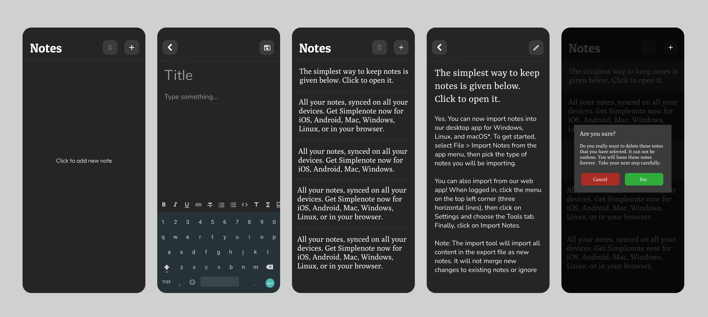
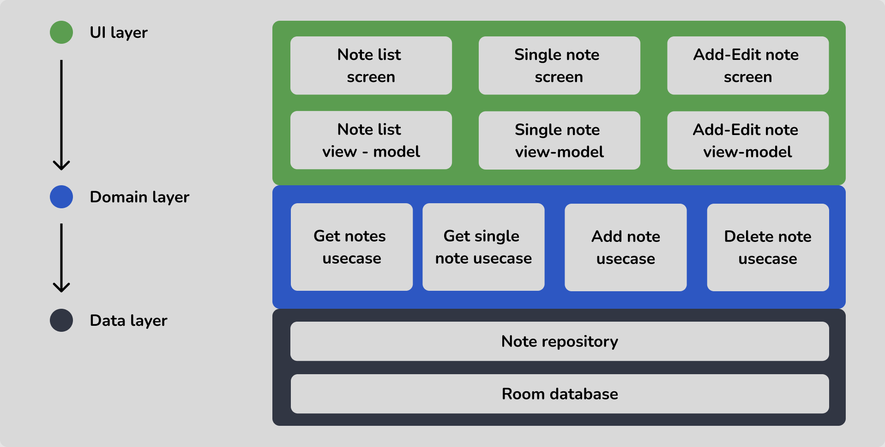

# Notepad-Android-App
A Clean Architecture Android Notepad App built with **Kotlin** + **MVVM** + **Hilt** + **Room database** + **Coroutine** + **Flow** + **Jetpack compose** + etc. Managed the **CI/CD** pipeline with GitHub Actions.

## Contents
- [Functional Requirements](#functional-requirements)
- [UI Design](#ui-design)
- [App Architecture](#app-architecture)

## Functional requirements
- Create note
- Edit note
- Delete note
- Show single note in one screen
- Show all the notes in a list (with last edited item in the top)

## UI design

## App Architecture
